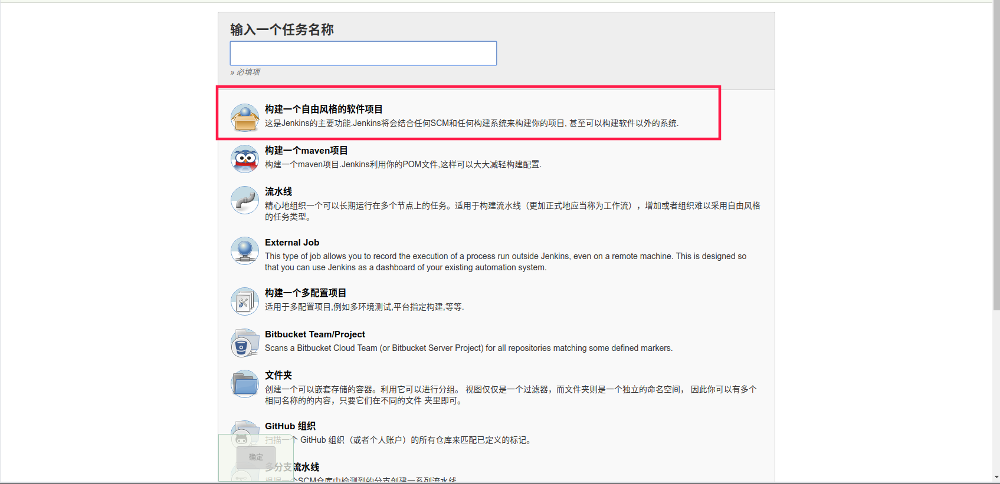
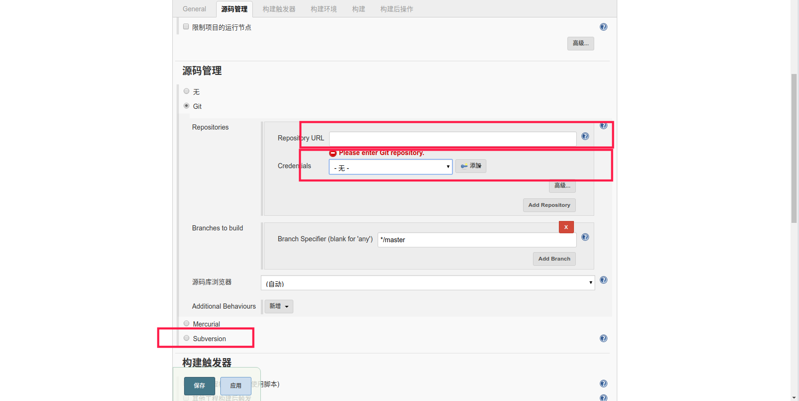
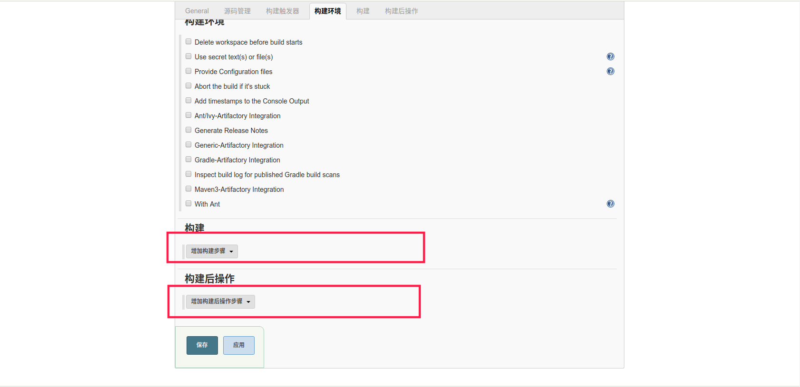
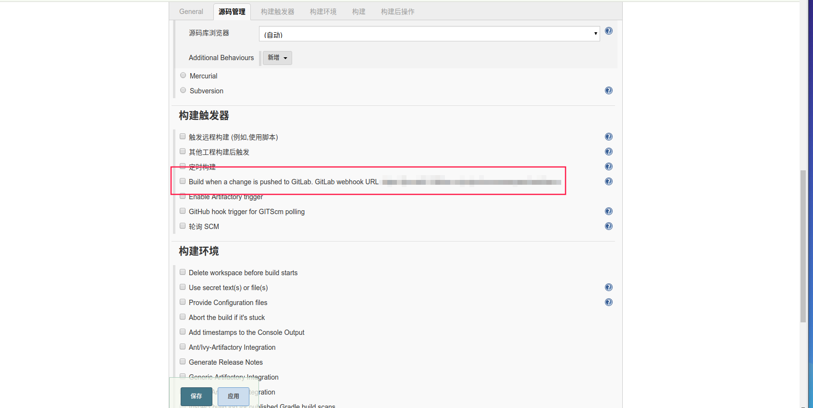
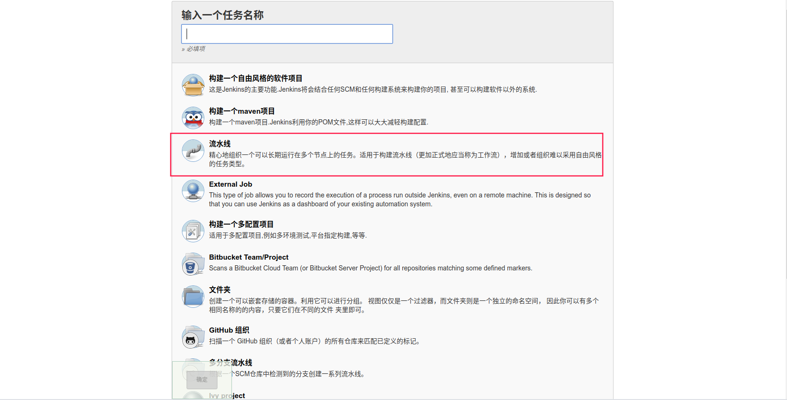
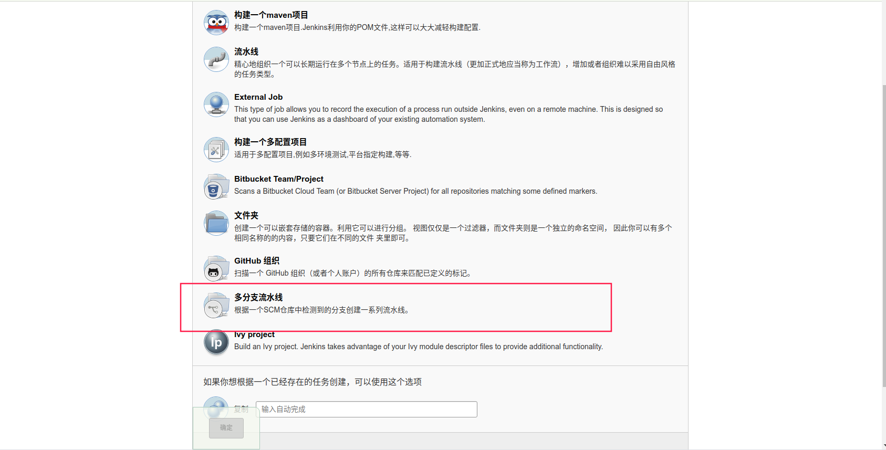

# Jenkins101
这是一个 jenkins 的中文介绍教程．

> 精细完整的文档，　清务必参考 jenkins 的官网: https://jenkins.io/zh/
## 安装 Jenkins
* docker 安装
直接使用 docker run 安装最新版本的 jenkins
```shell
docker run -u root --rm -it -d -p 8080:8080  -p 50000:50000  -v jenkins-data:/var/jenkins_home  -v /var/run/docker.sock:/var/run/docker.sock  jenkinsci/blueocean 
```
当然，　也可以使用　docker-compose 来安装
```shell
docker-compose up -d
```
```yml
version: '3'
services:
    jenkins:
    image: 'jenkins/jenkins:lts'
    container_name: jenkins
    restart: always
    ports:
        - '8080:8080'
        - '50000:50000'
    volumes:
        jenkins_home:/var/jenkins_home
volumes:
    jenkins_home:
        external: true
```
* JAVA War 包安装
```shell
java -jar jenkins.war
```
* yum,apt,brew,pacman安装
通过包管理工具也能安装 jenkins

1. yum 安装 jenkinsfile
```shell
sudo wget -O /etc/yum.repos.d/jenkins.repo https://pkg.jenkins.io/redhat-stable/jenkins.repo
sudo rpm --import https://pkg.jenkins.io/redhat-stable/jenkins.io.key
yum install jenkins
```
2. apt 安装 jenkins
```shell
wget -q -O - https://pkg.jenkins.io/debian/jenkins-ci.org.key | sudo apt-key add -
sudo sh -c 'echo deb http://pkg.jenkins.io/debian-stable binary/ > /etc/apt/sources.list.d/jenkins.list'
sudo apt-get update
sudo apt-get install jenkins
```
3. mac 上 brew 安装 jenkins
```shell
brew update && brew install jenkins
```
4. arch 上使用 pacman　安装 jenkins
```shell
pacman -S jenkins
```

## Jenkins 的用户界面
* 经典界面
* Blue Ocean

jenkins　的用户界面有两种，　一种是经典模式的界面，　另一种是　Blue Ocean　界面，　Blue Ocean　目前是插件的方式存在，　如果要想使用这个 UI 界面，　需要单独安装这个插件. 在未来　Blue Ocean　会组件取代现有的经典模式的功能。随着Blue Ocean的成熟，用户回到经典UI的理由将越来越少。

## 创建任务
* 自由风格
* 流水线
* 多分支流水线

在说创建任务之间，要先说一个　jenkins 中的文件夹的。在 jenkins 中项目是存放在文件中的，　这里的文件夹也就相当于分组的意思，　我们可以通过将任务合理组织在各个文件夹中来达到隔离权限的目的。

１. 自由风格

如图，填写名字以后选择第一个

支持 git 和 svn ，在填写仓库的时候，注意加上仓库认证的账号和密码

在邮件步骤中加入自己的构建中要执行的操作

推荐将构建过程写在仓库中，比如 `build.sh` 或者 `build.bat` ,在构建步骤中直接执行预定义的构建脚本，这样你的构建脚本也能被版本管理起来。
如果你先刚要通过 gitlab 来触发构建，　那么你应该在　gitlab 或者 github　上配置对应的 webhook


2. 流水线

流水先的写法和自由风格不一样，　他是使用　groovy 语言的　DSL 来编写构建过程，关于 DSL 的语法，　清参考 jenkins 的官方网站。同样也支持　github 和　gitlab 的 webhook触发。


3. 多分支流水线

多分支流水线和流水线一样，　也是使用的 DSL　的语法，　需要你在项目里面添加一个 `Jenkinsfile`, 当然，这个文件名字你是可以指定的。
